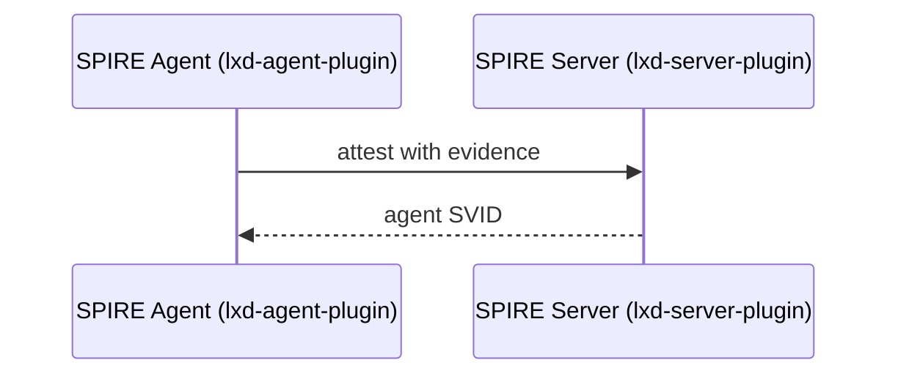

# Attestation overview

How an LXD instance's SPIRE Agent gets its identity (placeholder until the design is settled).

```mermaid
sequenceDiagram
    participant agent as SPIRE Agent (lxd-agent-plugin)
    participant server as SPIRE Server (lxd-server-plugin)
    agent->>server: attest with evidence
    server-->>agent: agent SVID
```
