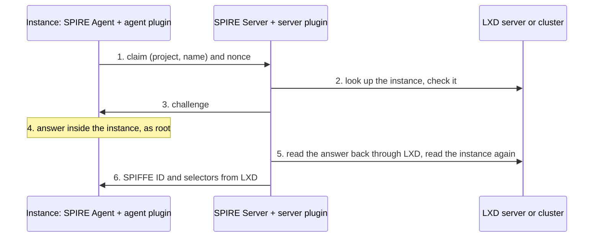

# Attestation overview

How an LXD instance's SPIRE Agent gets its identity: the claim goes to SPIRE Server, the facts and the proof come through LXD.

```mermaid
sequenceDiagram
    participant A as Instance: SPIRE Agent + agent plugin
    participant S as SPIRE Server + server plugin
    participant L as LXD server or cluster
    A->>S: 1. claim (project, name) and nonce
    S->>L: 2. look up the instance, check it
    S->>A: 3. challenge
    Note over A: 4. answer inside the instance, as root
    S->>L: 5. read the answer back through LXD, read the instance again
    S->>A: 6. SPIFFE ID and selectors from LXD
```
