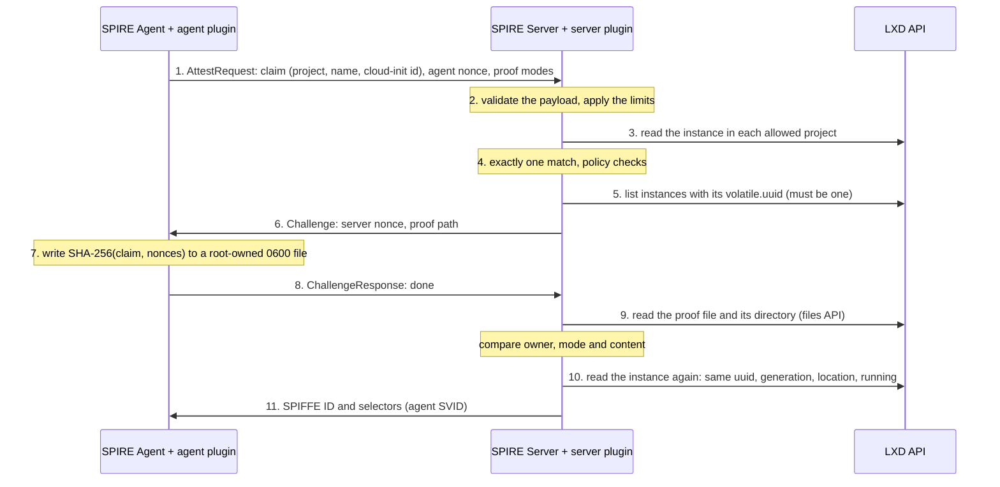

# Attestation sequence

One attestation with the `file_pull` proof mode, from the agent's claim to its SVID; `config_push` replaces steps 6 to 9 (see the text).

```mermaid
sequenceDiagram
    participant A as SPIRE Agent + agent plugin
    participant S as SPIRE Server + server plugin
    participant L as LXD API
    A->>S: 1. AttestRequest: claim (project, name, cloud-init id), agent nonce, proof modes
    Note over S: 2. validate the payload, apply the limits
    S->>L: 3. read the instance in each allowed project
    Note over S: 4. exactly one match, policy checks
    S->>L: 5. list instances with its volatile.uuid (must be one)
    S->>A: 6. Challenge: server nonce, proof path
    Note over A: 7. write SHA-256(claim, nonces) to a root-owned 0600 file
    A->>S: 8. ChallengeResponse: done
    S->>L: 9. read the proof file and its directory (files API)
    Note over S: compare owner, mode and content
    S->>L: 10. read the instance again: same uuid, generation, location, running
    S->>A: 11. SPIFFE ID and selectors (agent SVID)
```
