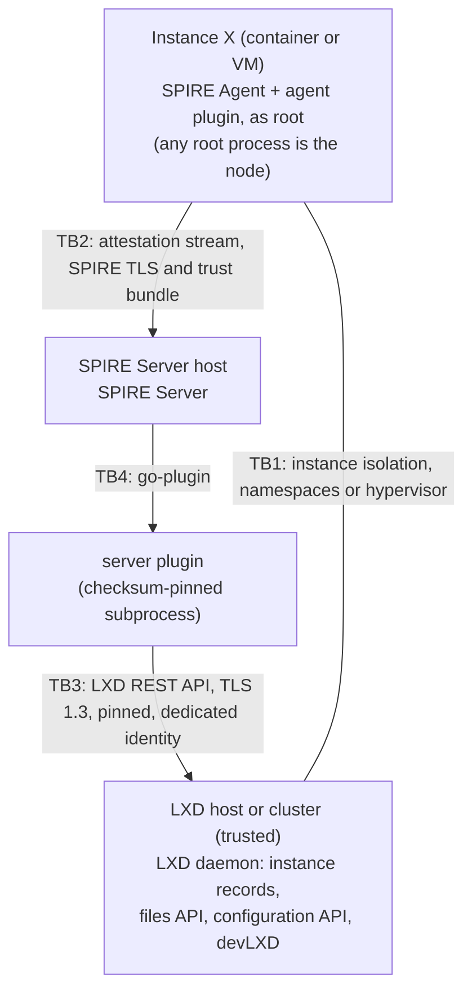

# Trust boundaries

The components and the trust boundaries (TB1 to TB4) the attestation crosses.

```mermaid
flowchart TB
    agent["Instance X (container or VM)<br/>SPIRE Agent + agent plugin, as root<br/>(any root process is the node)"]
    daemon["LXD host or cluster (trusted)<br/>LXD daemon: instance records,<br/>files API, configuration API, devLXD"]
    spire["SPIRE Server host<br/>SPIRE Server"]
    plugin["server plugin<br/>(checksum-pinned subprocess)"]
    agent -- "TB2: attestation stream, SPIRE TLS and trust bundle" --> spire
    spire -- "TB4: go-plugin" --> plugin
    plugin -- "TB3: LXD REST API, TLS 1.3, pinned, dedicated identity" --> daemon
    daemon -- "TB1: instance isolation, namespaces or hypervisor" --- agent
```
